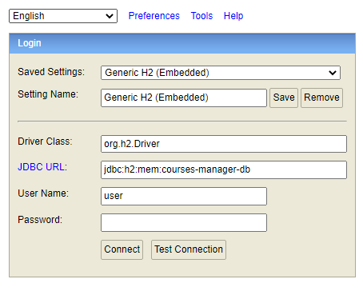

## <u>Exercice PMU courses-manager</u>

### <u># Commentaire d'ordre général :</u>

Exercice réalisé en plus de 2h, non pas pas comme précisé dans l'énoncé. 
Le cabinet de recrutement, lui évoque 4h. J'ai aussi dépassé. Je ne saurais même pas dire le temps que j'y ai passé. 6h en tout peut-être... 
Cet exercice m'a donné l'envie de m'y remettre en tous les cas et de découvrir Kafka. Je suis curieux de voir comment tout cela s'articule dans une architecture complète. 
Pour être honnête, l'exercice est intéressant mais je ne dois pas être à la hauteur des exigences de PMU car pour moi en 2h, il faut envoyer du lourd et ne pas se poser de questions. 
Je suis aussi conscient que l'exercice devait permettre de trouver un algo permettant de gérer les trous. J'avoue que je ne le connais pas. J'ai trouvé un moyen mais sûrement pas optimisé sur des grandes suites et brimbalant le cas où le premier partant n'est pas le 1 génère deux lignes... 

### <u># Réalisé :</u>

**Cas fonctionnel :**

- Le cas fonctionnel a été réalisé, a priori, dans l'ensemble. 
Je me suis peut-être posé trop de questions sur les règles à mettre en place et notamment sur le fait de pouvoir ou non mettre à jour des partants s'ils en existait déjà sur une course.

**Points techniques :**

- <u>Kafka</u> 
Jusqu'alors inconnu pour ma part, Kafka ne fonctionne pas. 
J'ai tout de même fait quelques recherches pour l'implémenter. 
Le problème est que le broker n'existe pas donc la connexion ne se fait pas. 
J'ai commenté tout le code de cette partie.

- <u>Tests unitaires ou d'intégration</u> 
La partie test n'a pas été réalisée. J'ai tout de même testé par SoapUI que mon webservice était appelable et qu'il répondait au besoin fonctionnel.

- <u>Tests SoapUI</u> 
L'URL est disponible en démarrant le projet sous http://localhost:9090/courses-manager/race/create    
JSONs en entrée :   
Cas passant : fichier ok.json dans le répertoire test/resources/input du projet controller. 
Cas non passants : fichiers ko_xxx.json dans le répertoire test/resources/input du projet controller.  
Résultats obtenus :  
Cas passant : fichier ok.txt dans le répertoire test/resources/output du projet controller.
Cas non passants : fichiers ko_xxx.txt dans le répertoire test/resources/output du projet controller.

- <u>BDD</u> 
La base H2 est consultable depuis http://localhost:9090/courses-manager/h2-console  
  
Le mot de passe est très complexe et sécurisé : password